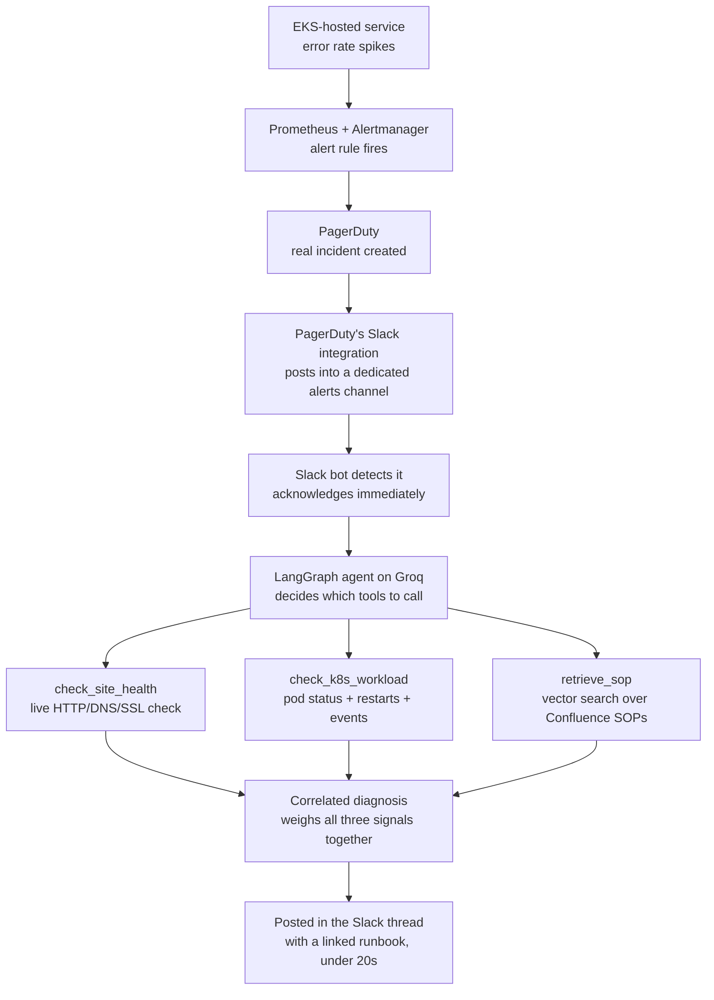

# SRE Diagnostic Agent

An AI agent that turns a real incident alert into an actual diagnosis —
not just a notification. When a monitored service degrades, this project
runs a real Kubernetes health check, a real HTTP sanity check, and a real
search over the team's runbooks, then posts one correlated conclusion
back into the same Slack thread — with a linked SOP — in under 20 seconds.

It's the sequel to
[`slack-pagerduty-incident-bot`](https://github.com/nikhilmourya36/Slack-Incident-Automation-LLM-Project),
an earlier project where a human had to type "is the site down?" for the
bot to check anything. This project removes the human from the trigger
entirely: a real Prometheus alert on a real EKS cluster is what starts
the investigation.

> This README is written to be the only document you need — everything
> about the architecture, the design decisions, and the build order lives
> here.

---

## Table of contents

1. [The problem this solves](#the-problem-this-solves)
2. [How it works (architecture)](#how-it-works-architecture)
3. [Why the trigger is Slack, not a webhook](#why-the-trigger-is-slack-not-a-webhook)
4. [The core design principle](#the-core-design-principle)
5. [What's real vs. what's reused](#whats-real-vs-whats-reused)
6. [Project structure](#project-structure)
7. [The tools](#the-tools)
8. [RAG: Confluence-backed SOP retrieval](#rag-confluence-backed-sop-retrieval)
9. [Setup, step by step](#setup-step-by-step)
10. [Known limitations](#known-limitations)
11. [What's explicitly out of scope](#whats-explicitly-out-of-scope)
12. [Stack](#stack)

---

## The problem this solves

When something breaks — a 5xx spike, a crash-looping pod — an alert fires
and on-call gets paged. Then a human has to manually check five different
places before they even know where to start: the service itself,
Kubernetes, recent deploys, other dashboards, and whatever runbook might
already exist for this exact situation.

This project automates that first five minutes. The moment a real
Prometheus alert fires on a real EKS cluster, an agent:

1. Runs a real HTTP/DNS/SSL sanity check against the affected service
2. Checks the actual Kubernetes workload — pod status, restart counts,
   recent events
3. Searches the team's Confluence runbooks for the SOP that actually
   matches what's happening
4. Writes ONE synthesized, correlated conclusion — not a dump of raw tool
   output — and posts it in the incident's Slack thread, with a linked
   runbook

PagerDuty continues to page on-call exactly as it already did — this
project doesn't touch or gate that. It's purely about giving the on-call
engineer a head start instead of starting from zero.

---

## How it works (architecture)



Every box in that diagram is real infrastructure, not a mock: a real AWS
EKS cluster, a real `kube-prometheus-stack` install, a real PagerDuty
service, and a real Slack workspace. There's a small demo backend service
deployed on the cluster with two endpoints (`/break/5xx/on`,
`/break/crash`) specifically so the whole pipeline can be triggered
on-demand and tested end to end, rather than waiting for a real outage.

---

## Why the trigger is Slack, not a webhook

The original plan was for Grafana/Alertmanager to push a webhook directly
to an HTTP listener the agent runs. That plan changed once the agent's
actual runtime was decided: it runs in a notebook environment (for demo
purposes), which has no public inbound URL by default — there was nowhere
for a webhook to land without standing up a tunnel just for this.

Instead, the agent reuses the exact pattern proven in the prior project:
a Slack bot in **Socket Mode**, which opens an outbound-only websocket
connection to Slack. Nothing needs to reach *into* the agent's
environment at all.

That still leaves the question of how an alert gets to Slack in the first
place. Two options were considered:

- **Alertmanager posts to Slack directly** — works, but means maintaining
  two separate notification integrations (Alertmanager's Slack receiver
  and PagerDuty's own Slack app) that would both need to stay configured
  correctly.
- **Alertmanager posts to PagerDuty, and PagerDuty's own (already
  excellent) Slack integration relays it** — one integration to maintain,
  and it reuses the PagerDuty setup that was already working from the
  prior project.

The second option won. The accepted tradeoff: Slack visibility now
depends on PagerDuty's Slack integration being up, since there's no
independent Alertmanager → Slack path. That's a reasonable tradeoff for
this project, not necessarily the right call for a production system with
stricter uptime requirements on the notification path itself.

The dedicated `#sre-alerts` channel (not the channel humans normally post
in) is what lets the bot tell a real incident apart from a person asking
a question — channel identity alone answers that, with no message-content
guessing involved.

---

## The core design principle

**The agent never gets to assert a conclusion from its own reasoning
alone.** Every claim in its final message has to trace back to a real
tool result — a live check that actually ran, a Confluence page that
actually exists. The agent's job is to run the right tools, correlate
what they found, and explain it clearly. Not to guess.

Concretely, this means the system prompt explicitly pushes toward
correlated reasoning rather than a flat list of findings — e.g.
"restarts happened right when the error rate spiked" is a much stronger,
more useful signal than reporting "there were restarts" and "there were
errors" as two disconnected facts. And every SOP the agent cites is a
real, clickable link back to the source page, not a paraphrase.

---

## What's real vs. what's reused

This project reuses two specific, proven pieces from the prior Slack bot
project, and builds everything else fresh:

| Component | Status |
|---|---|
| `agent/tools/sanity_checker.py` | Reused as-is from the prior project |
| `agent/pagerduty_client.py` | Reused as-is — still fires independently, the agent doesn't call this itself |
| Slack posting pattern (Bolt, Socket Mode) | Same pattern, new event-detection logic (bot-posted incidents, not human messages) |
| `agent/tools/check_k8s_workload.py` | New — built for this project |
| `agent/tools/retrieve_sop.py` | New — built for this project |
| `agent/graph.py` (the LangGraph agent) | New — built for this project |
| The entire EKS cluster, Prometheus/Grafana stack, demo backend | New — built from scratch as part of this project |
| The Confluence sync pipeline (`sync/`) | New — built for this project |

---

## Project structure

```
.
├── infra/                        # The target system + observability stack
│   ├── terraform/                 # Minimal EKS cluster + ECR repo (Terraform)
│   ├── app/                       # Demo backend (Flask) with on-demand
│   │                                #   /break/5xx and /break/crash endpoints
│   ├── k8s/                       # Kubernetes Deployment/Service manifests
│   ├── observability/             # kube-prometheus-stack Helm values,
│   │                                #   the one alert rule, Alertmanager ->
│   │                                #   PagerDuty config
│   ├── README.md                  # Full infra setup walkthrough
│   └── REBUILD_CHECKLIST.md       # Exact commands to rebuild after a
│                                    #   `terraform destroy` (this project
│                                    #   tears the cluster down between
│                                    #   sessions to avoid idle billing)
│
├── sops/                         # 11 runbooks, synced into Confluence
│                                    #   (5xx spikes, crash loops, FD
│                                    #   exhaustion, rollback, DNS, etc.)
│
├── sync/                         # Confluence -> vector DB pipeline
│   ├── 00_test_connection.py      # Step 1: prove Confluence API access
│   ├── 01_survey_structure.py     # Step 2: check heading structure
│   ├── 02_chunk_and_embed.py      # Step 3: chunk by heading, embed into Chroma
│   └── 03_test_retrieval.py       # Step 4: prove retrieval quality
│
├── agent/
│   ├── graph.py                   # The LangGraph agent itself
│   ├── slack_listener.py          # Slack event listener (Socket Mode)
│   ├── pagerduty_client.py        # Reused from the prior project
│   └── tools/
│       ├── sanity_checker.py      # Reused from the prior project
│       ├── check_k8s_workload.py  # Kubernetes pod health check
│       └── retrieve_sop.py        # Vector search over synced SOPs
│
├── config/
│   └── settings.py                # All configuration, loaded from .env
│
├── .env.example                  # Template for required environment variables
└── requirements.txt
```

---

## The tools

The agent has three tools available, each backed by a real system:

| Tool | What it actually does |
|---|---|
| `check_site_health` | Runs a real DNS/HTTP/latency/SSL check against the service |
| `check_k8s_workload` | Queries the real Kubernetes API for pod status, restart counts, and recent events for the affected deployment |
| `retrieve_sop` | Runs a similarity search against a local vector database of the team's Confluence SOPs, returning up to 3 candidates with their source links |

These are implemented as plain LangGraph `@tool` functions — not as an
MCP server. That was a deliberate choice: the exact tool set is known
upfront and only this one agent calls them, so MCP's dynamic-discovery
and cross-client benefits don't apply here, while its cost (a new service
to deploy, a new transport/auth surface) would add real complexity on top
of an already multi-layer build. Worth revisiting as a v2 if the tools
ever need to be shared across multiple agents or clients.

Three more tools are designed but not yet built: `check_logs`,
`check_grafana_metric`, and `check_recent_releases` — added only after
the current three are proven solid, per the project's build philosophy
below.

---

## RAG: Confluence-backed SOP retrieval

SOPs are pulled from Confluence, chunked, and embedded into a local
**Chroma** vector database using a local `sentence-transformers` model —
no external embedding API, no cost per query.

Two important design choices here:

**Chunking is by heading/section, not by fixed character count.** An
SOP's value is in its ordered steps — a chunk boundary that splits "step
2" from "step 3" is actively harmful, not just imprecise. "Related SOPs"
sections are deliberately excluded from embedding: they're short,
title-dense cross-reference lists that were found (via real retrieval
testing) to outcompete a SOP's own actual content in similarity search,
which meant a page could win a top-1 slot purely by mentioning another
SOP's name.

**The agent never queries Confluence live, at incident time.** Retrieval
only ever hits the local Chroma database — a real incident is the wrong
moment to add a dependency on a third-party API being fast and available.
The sync (`sync/02_chunk_and_embed.py`) runs on its own schedule,
independent of any incident, and only re-embeds pages whose Confluence
version actually changed since the last run.

**retrieve_sop returns the top 3 matches, not just 1.** Real testing
showed that some incidents genuinely match more than one SOP equally
well — rather than force a single "best" answer, the tool surfaces the
real candidates and lets the agent's own reasoning, which has the full
incident context (not just the bare query text), decide which one
actually fits.

---

## Setup, step by step

### Prerequisites

- An AWS account (this creates real, billed infrastructure — see the
  cost note below)
- Terraform, `kubectl`, `aws` CLI, Docker
- A Confluence space with SOP pages (or fork/adapt the 11 in `sops/`)
- A Slack workspace, a PagerDuty account
- A free [Groq](https://console.groq.com) API key

### 1. Stand up the infrastructure

```bash
cd infra/terraform
terraform apply
```

Full walkthrough — including building/pushing the demo backend image and
deploying it — is in `infra/README.md`.

### 2. Install the observability stack

```bash
cd infra/observability
helm install kube-prometheus-stack prometheus-community/kube-prometheus-stack \
  --namespace monitoring --create-namespace \
  -f values.yaml
```

Full walkthrough, including how to prove the alert rule actually fires
against the demo backend's `/break/5xx/on` endpoint, is in
`infra/observability/README.md`.

### 3. Wire Alertmanager to PagerDuty

Get a PagerDuty Events API v2 integration key, then:

```bash
cp alertmanager-values.yaml alertmanager-values.local.yaml
# edit alertmanager-values.local.yaml, add your real routing key
helm upgrade kube-prometheus-stack prometheus-community/kube-prometheus-stack \
  --namespace monitoring \
  -f values.yaml -f alertmanager-values.local.yaml
```

Then connect PagerDuty's own Slack integration to your dedicated
alerts-only channel (one-time setup inside PagerDuty's own settings, not
config in this repo).

### 4. Sync your SOPs

```bash
cp .env.example .env
# fill in CONFLUENCE_* values

pip install -r requirements.txt
python sync/02_chunk_and_embed.py
python sync/03_test_retrieval.py   # confirm retrieval quality before moving on
```

### 5. Fill in the rest of `.env`

Slack bot tokens (Socket Mode enabled, `channels:history` /
`channels:read` / `chat:write` scopes, invited into your alerts channel),
and a Groq API key.

### 6. Run the agent

```bash
python -m agent.slack_listener
```

Trigger a real incident (manually via PagerDuty, or by hitting
`/break/5xx/on` on the demo backend) and watch the full pipeline run.

---

## Known limitations

**The demo backend's break switches are per-pod, not cluster-wide.**
`/break/5xx/on` and `/break/crash` flip in-memory state on whichever pod
happens to receive that specific request — with 2 replicas, this can mean
a break switch appears "stuck." A rolling restart
(`kubectl rollout restart deployment demo-backend`) forces a clean state.
This is test-harness behavior, not something the actual agent needs to
handle, so it isn't being fixed.

**Confluence sync is scheduled, not real-time.** If someone edits an SOP
mid-incident, the agent won't see that update until the next sync run.
Acceptable for this project; a production version might add a
manually-triggerable re-sync.

**The infrastructure is torn down between work sessions.** EKS, the NAT
gateway, and the node group all bill hourly regardless of use — this
project runs `terraform destroy` at the end of each session and
`terraform apply` again next time (see `infra/REBUILD_CHECKLIST.md`).

---

## What's explicitly out of scope

- Coda integration — Confluence only, kept deliberately tight
- Real-time Confluence sync
- Any automated remediation or rollback — this project diagnoses and
  informs; it never takes corrective action on its own
- Replacing or modifying the PagerDuty paging path — paging continues to
  fire independently of whatever the agent concludes
- `check_logs`, `check_grafana_metric`, `check_recent_releases` — designed,
  not yet built

---

## Stack

AWS EKS · Terraform · Prometheus · Grafana · Alertmanager · PagerDuty ·
Slack (Bolt, Socket Mode) · LangGraph · Groq · Confluence · Chroma ·
sentence-transformers